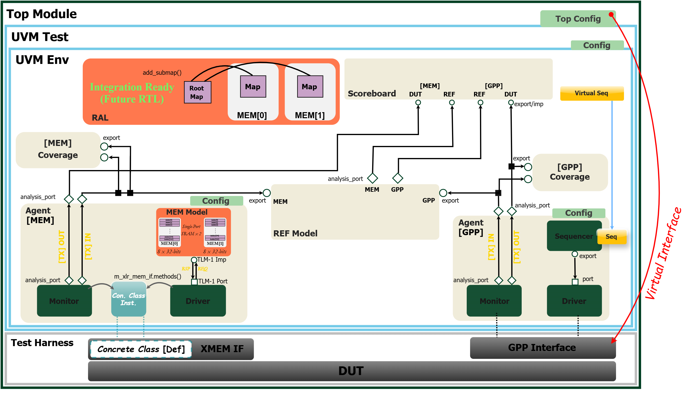

# Comprehensive UVM Verification Ecosystem for SoC Accelerator Validation

This repository contains the capstone project developed at the  
**Alexander Kofkin Faculty of Engineering, Bar-Ilan University**  
**Nano-Electronics Department – EnICS Labs**  

It provides a **complete and scalable UVM-based verification environment** for SoC accelerator validation,
featuring a unified testbench architecture, dual-agent support, and integration-ready RAL files.

## Architecture Overview

*Complete UVM verification ecosystem showing agents, environment hierarchy, and signal flow*

## Documentation

For detailed implementation architecture, see [`docs/UVM_Technical_Implementation.pdf`](docs/UVM_Technical_Implementation.pdf) (Chapter 4 from project documentation), which covers:
- Multi-layer abstraction framework
- Memory agent dual-mode architecture
- Key method implementations and design patterns
- Debug infrastructure and validation approach

## Author
- **Daniel Bernath**

**Academic Supervisor:** Prof. Adam Teman  
**Instructor:** Eliyahu Levi  
